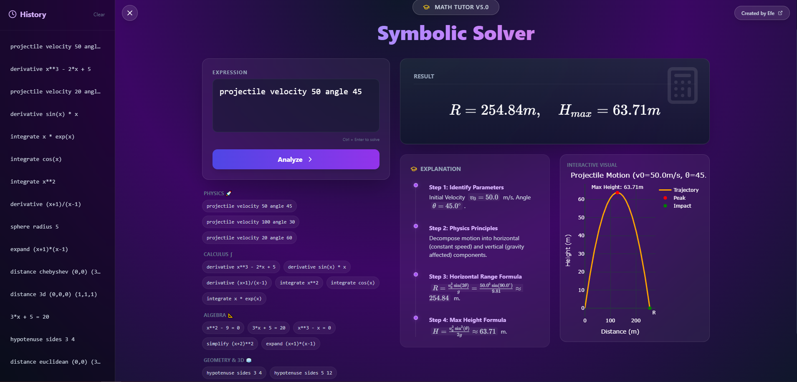
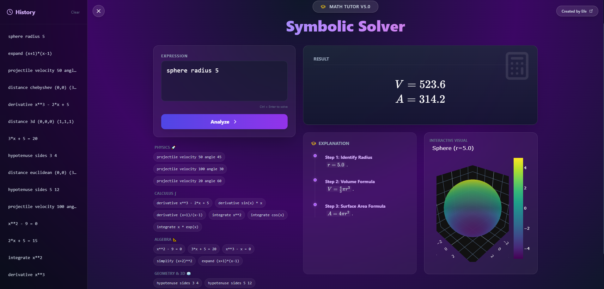
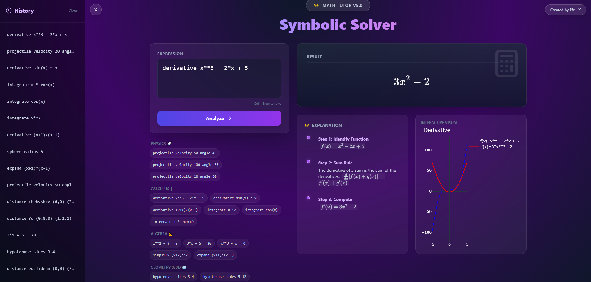
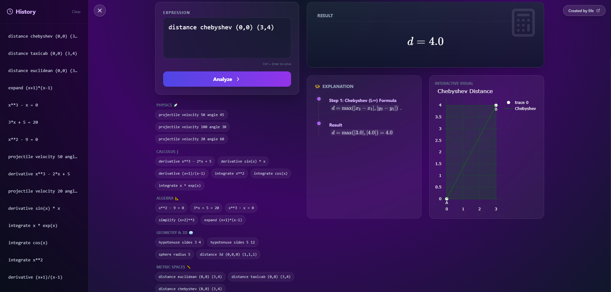
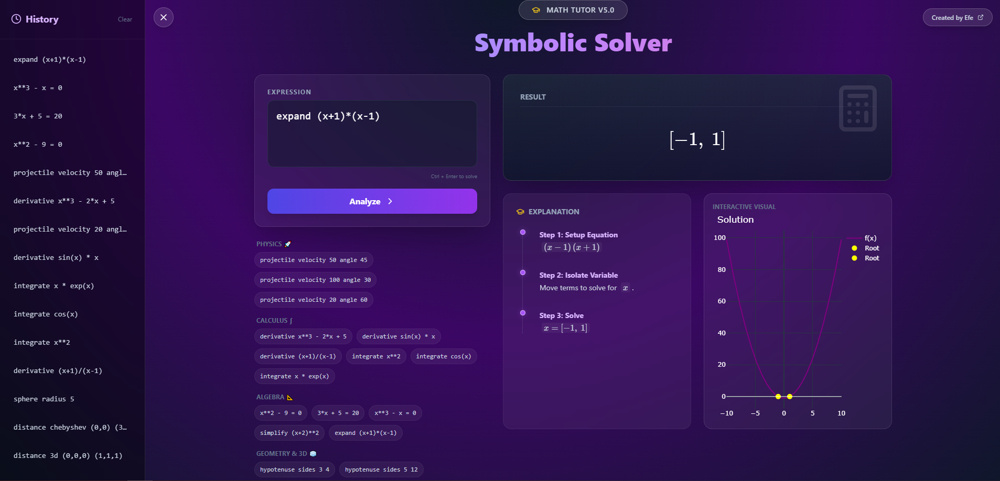

# 🧙‍♂️ Math Wizard (Symbolic Geometry Solver)


> **"Living Math" in your browser.**
> An interactive, symbolic mathematics engine capable of solving Algebra, Calculus, Geometry, and Physics problems with step-by-step explanations and dynamic 3D visualizations.

## 🛠️ Tech Stack

* **Frontend:** React (Vite), Tailwind CSS, Framer Motion, Plotly.js (3D Viz), KaTeX (Math Rendering)
* **Backend:** Python 3.9+, FastAPI, Uvicorn
* **Math Engine:** SymPy (Symbolic Mathematics), NumPy
* **Architecture:** RESTful API, MVC Pattern

## 🌟 Key Features

### 🧬 Interactive Engine (New!)
-   **Physics Simulation**: Visualize projectile motion with real-time trajectory plotting.
-   **3D Space**: Rotate, zoom, and explore spheres and 3D paths using **Plotly**.
-   **No Static Images**: Every chart is generated dynamically as a simplified JSON object.

### 🎓 Tutor Mode
-   **Step-by-Step Derivations**: The engine explains *how* it reached the solution (e.g., "Applying Power Rule", "Pythagorean Theorem").
-   **Timeline UI**: Follow the logic flow in a beautiful, vertical timeline interface.

### 🧠 Mathematical Core
-   **Algebra**: Solve equations (`x^2 - 9 = 0`) and simplify expressions.
-   **Calculus**: Compute derivatives (`diff`) and integrals (`int`) symbolically.
-   **Geometry**: Calculate distance metrics (Euclidean, Taxicab, Chebyshev) and triangle properties.

### 🎨 Premium UI
-   **Glassmorphism Design**: Modern, translucent aesthetics with `backdrop-blur`.
-   **History Tracking**: Your session history is saved automatically.
-   **Interactive Examples**: Learn the syntax instantly with the built-in "Example Chips".

---
## 🧠 How It Works

1.  **Input Parsing:** The user's natural language or mathematical syntax is parsed by the **FastAPI** backend.
2.  **Symbolic Computation:** **SymPy** processes the logic, solving equations symbolically (not just numerically).
3.  **Data Serialization:** Results are converted into **LaTeX** (for equations) and **JSON** (for graphs).
4.  **Dynamic Rendering:** React receives the data and renders interactive **3D plots** and mathematical proofs in real-time.
---

## � Gallery

<div align="center">
  
  
</div>
<div align="center">
  
  
</div>
<div align="center">
  
</div>

---

## �🛠 Installation

### Prerequisites
-   Python 3.9+
-   Node.js 16+

### 1. Clone the Repository
```bash
git clone https://github.com/your-username/Symbolic-Geometry-Solver.git
cd Symbolic-Geometry-Solver
```

### 2. Backend Setup
```bash
cd backend
python -m venv venv
# Windows
venv\Scripts\activate
# Mac/Linux
source venv/bin/activate

pip install -r requirements.txt
```

### 3. Frontend Setup
```bash
cd ../frontend
npm install
```

---

## 🚀 Usage

### Option A: One-Click Start (Windows)
Simply run the included script:
```bash
setup_and_run.bat
```

### Option B: Manual Start
**Terminal 1 (Backend):**
```bash
cd backend
venv\Scripts\activate
uvicorn main:app --reload
```

**Terminal 2 (Frontend):**
```bash
cd frontend
npm run dev
```

Visit `http://localhost:5173` in your browser.

---

## 📝 Example Commands

| Category | Command | Description |
|----------|---------|-------------|
| **Physics** | `projectile velocity 50 angle 45` | Simulate a 45° launch at 50m/s |
| **Algebra** | `x**2 - 9 = 0` | Find roots of the quadratic equation |
| **Calculus** | `derivative x**3 - 2*x` | Differentiate the function |
| **Calculus** | `integrate cos(x)` | Find the antiderivative |
| **Geometry** | `hypotenuse sides 5 12` | Solve for hypotenuse & draw triangle |
| **3D** | `sphere radius 5` | Generate a 3D interactive sphere |
| **Metric** | `distance taxicab (0,0) (4,3)` | Calculate Manhattan distance |

---

## 🤝 Contributing

Contributions are welcome! Please feel free to open an issue or submit a Pull Request.

1.  Fork the Project
2.  Create your Feature Branch (`git checkout -b feature/AmazingFeature`)
3.  Commit your Changes (`git commit -m 'Add some AmazingFeature'`)
4.  Push to the Branch (`git push origin feature/AmazingFeature`)
5.  Open a Pull Request

## 📄 License

Distributed under the MIT License. See `LICENSE` for more information.
